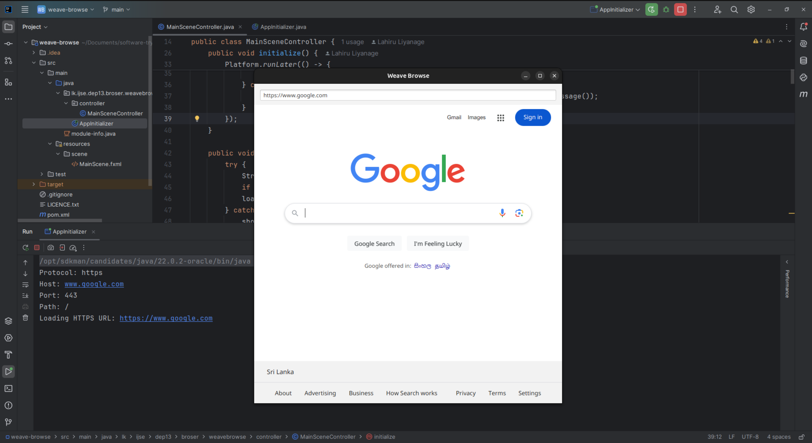

# WeaveBrowse

A hands-on exploration of HTTP protocol implementation through a simple web browser built with JavaFX. This project serves as a practical demonstration of my understanding of fundamental web protocols and network programming concepts.

## 🎯 Project Purpose

This project was developed to:
- Demonstrate practical understanding of HTTP protocol mechanics
- Showcase real-world implementation of socket programming
- Illustrate URL parsing and web resource handling
- Present clean, well-documented code for educational purposes

## 🌟 Key Learning Demonstrations

### HTTP Protocol Implementation
- Manual HTTP request construction and header handling
- Socket-based network communication
- URL component parsing and validation
- Protocol-specific port handling (HTTP: 80, HTTPS: 443)

### Technical Skills Showcased
- Java and JavaFX programming
- Network programming fundamentals
- Error handling and user feedback
- Clean code architecture
- UI/UX considerations in application design

## 💻 Features

- Interactive URL parsing with real-time feedback
- Raw HTTP protocol handling demonstration
- Web page rendering using JavaFX WebView
- Educational console output for learning purposes
- User-friendly error notifications

## 🔧 Technologies Used

- Java
- JavaFX
- Socket Programming
- HTTP Protocol

## 📸 Screenshots



## 📋 Setup Instructions
### Prerequisites
- Java Development Kit (**JDK 11+**)
- JavaFX SDK (if not bundled with JDK)
- A Java-compatible IDE (IntelliJ IDEA recommended)

### Installation
1. **Clone the Repository:**
   ```bash
   git clone https://github.com/yourusername/WeaveBrowse.git
   ```
2. **Navigate to the Project Folder:**
   ```bash
   cd WeaveBrowse
   ```
3. **Run the Application:**
   Compile and run the JavaFX project through your IDE or using the command line.
## 🚀 Usage Guide

1. Launch WeaveBrowse
2. Enter a URL (e.g., "google.com" or "http://example.com")
3. Observe the console output to see:
    - URL component breakdown
    - HTTP request construction
    - Connection establishment
    - Response handling

## 🎓 Educational Components

### URL Processing Demonstration
```java
Protocol: http
Host: example.com
Port: 80
Path: /index.html
```

### HTTP Request Structure
```http
GET /index.html HTTP/1.1
Host: example.com
User-Agent: WeaveBrowse/1.0
Accept: text/html,application/xhtml+xml
Connection: close
```

## 🔄 Development Process

This project was developed with a focus on:
1. Understanding HTTP protocol fundamentals
2. Implementing networking concepts
3. Creating educational code examples
4. Maintaining clean code practices

## 🌱 Future Enhancements

- HTTPS protocol implementation
- Extended HTTP header support
- Request/Response logging system
- Protocol analysis tools

## 👨‍💻 About the Developer

This project is part of my portfolio demonstrating:
- Practical implementation of networking concepts
- Clean code practices
- Technical documentation skills
- Educational content creation

Feel free to explore the code and reach out if you have any questions about the implementation or concepts demonstrated!

## 📫 Connect With Me

For any questions or feedback, feel free to reach out:

- Mobile: [+94719607296](+94719607296)
- Email: [lhlahiru95@gmail.com](lhlahiru95@gmail.com)
- LinkedIn: [LahiruLiyanage](https://www.linkedin.com/in/liyanage-lahiru/)
- GitHub: [@LahiruLiyanage](https://github.com/LahiruLiyanage)

## 📄 License

This project is open-source and available under the [MIT License](LICENCE.txt).

---
*This project was created as an educational demonstration of HTTP protocol implementation. While functional, it's primarily intended to showcase understanding of web protocols and network programming concepts.*